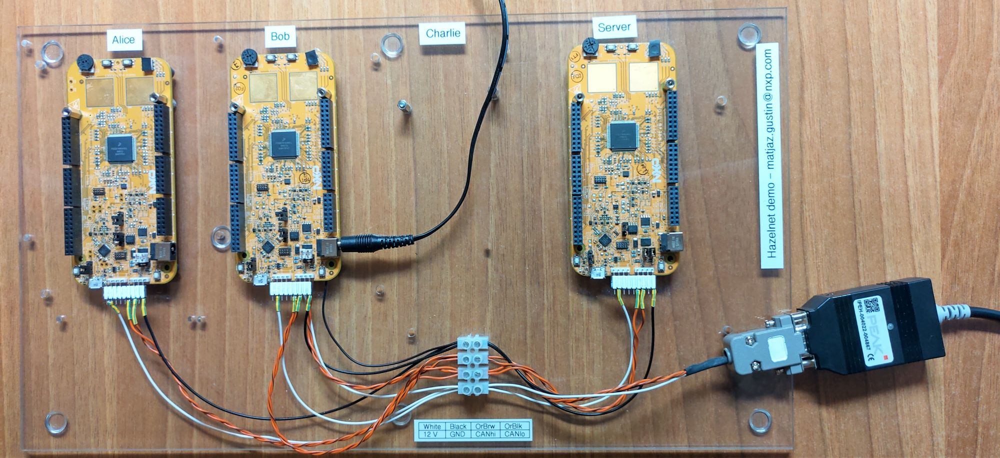

Hazelnet demo platform
==============================================================================

This platform showcases the
[Hazelnet library](https://github.com/TheMatjaz/Hazelnet) in action, where a
set of NXP S32K144 microcontrollers exchange encrypted and authenticated
messages over the CAN FD bus accoring to the
[CAN Bus Security (CBS) protocol](https://matjaz.it/cbs/).

This demo is **not meant for reproducibility**, as it's hard to install all
required tools (some are bound by licenses) and to set up the project.
The purpose of this repository is **to provide source code to read** as an
example on how the Hazelnet library could be used (mostly the
`src/hzlPlatform_TaskHzl.c` file).




Features
----------------------------------------

- Server and Clients (Alice, Bob, Charlie) firmwares with FreeRTOS.
- Received CAN FD messages are enqueued by the FLEXCAN callback for the main
  application to dequeue.
- A timer periodically notifies the main application that a transmission
  of dummy data should be performed.
- The main application decrypts any received secured messages and periodically
  transmits secured messages. On startup each Client tries to get the Session
  information from the Server.
- Log messages are transmitted unencrypted back on the bus just to notify the
  human operator of the device behaviour. NOTE: this is just to showcase the
  correct exchange of encrypted data for demo purposes - it should NEVER
  be done in production system.


### Project structure

Cronologically, from the reset of the board, the logic flow goes as follows:

- `main.c` is entered, which starts the FreeRTOS
- `hzlPlatform_FreeRtosStart.c` is used to prepare the clock, pins
  and start the task. `hzlPlatform_FreeRtosHooks.c` contains functions
  that the RTOS calls on certain idle situations or errors.
- `hzlPlatform_TaskHzl.c` contains the only task, which on start:
  - initialises the FLEXCAN driver with `hzlPlatform_Flexcan.c`
  - initialises the Hazelnet library
  - initialises the events on button press with `hzlPlatform_Buttons.c`
  - initialises a periodic timer used to know when to transmit dummy data
    with `hzlPlatform_TxTimer.c`
  - synchronises the CBS Session information between the Client and Server
- The task waits for events to happen in order to do something, which are:
  - The FLEXCAN driver placing a received CAN FD message in the RX queue.
    Received messages are processed, unpacked, decode by Hazelnet and
    reacted upon by transmitting an unsecured message on the bus.
  - The TxTimer notifying that a dummy transmission should happen.
  - The Button 1 or 2 being pressed notifying that the user requested a
    powerdown of the Client (does nothing for the Server) or a manual
    re-sync of the Session information.


Compiling and flashing the project
----------------------------------------

> This is a long and complex process. You probably don't need to do this,
> just read the firware code in `Sources/hzlPlatform_TaskHzl.c` and a few
> related files in the same directory.
>
> You have been warned.


***********************************************


### Required hardware

To make the devices communicate securely:

- 2-4 S32K144 demo boards. 2 is the bare minimum, 3 is enough to showcase
  the multicasting of the messages.
- CAN bus wiring between the boards.
- 12 V power supply for all the boards. See the note below.

Details on **how to connect the boards** are available in the diagrams in the
[Documentation folder](Documentation/hazelnet_demo_platform_hardware.pdf).

To actually see what is going on on the bus, a sniffer is required, such as the
[PEAK System PCAN-USB FD](https://www.peak-system.com/PCAN-USB-FD.365.0.html).
Any CAN transceiver that can forward the sniffed messages to a desktop/laptop
computer is sufficient, but the user may need to parse the received messages
manually. For this reason, the sniffer itself is out of scope for this
repository.


#### A note on supplying the boards with power

A 12 V power supply is required for the platform, otherwise the CAN
transceiver will not work properly. The 5 V via USB are **not** enough.

Make sure to set the power supply jumper J107 placed towards the core to allow
12 V supply rather than 5 V via USB.


### Required software

The S32 platform IDE and toolchains are required to compile and flash the
devices. Unfortunately, the binaries cannot be provided as-is because the
memory of the devices needs to be partitioned properly in order to use the
true random number generator, and to do that the IDE is needed.

1. Download and install
   [_S32 Design Studio IDE for ARM v2.2_ (S32DS-IDE-ARM-V2-X)](https://www.nxp.com/design/software/development-software/s32-design-studio-ide/s32-design-studio-for-arm:S32DS-ARM?#downloads). Pay attention to pick the proper version.
   **You may need an account to get a license for the IDE**.
   Download the installation guide PDF that is made available next to the
   installer, after you accept the terms and conditions.

2. Then, download the patches _S32 Design Studio for ARM 2.2 Update 1 S32 SDK
   for S32K1xx SR RTM 3.0.3_ (S32DS_ARM_v2.2_UP1). The instructions on how to
   install it are available in the IDE installation guide PDF.


### Preparing of the boards flash (once per board only)

The Cryptographic Security Engine compact (CSEc) module, used to generate
true-random numbers, requires the S32K144 flash to be partitioned in a proper
way. This is required to be done once per board. Afterwards the firmware
of the Hazelnet Demo Platform can be flashed multiple times, as it does not
touche the flash memory.

1. Open the S32 Design Studio for Arm IDE.
2. Open the example project `csec_keyconfig_s32k144`
   (File > New > S32DS Project from example > search for the project name).
3. Launch the debugger on the `Debug_RAM` target (Important: **not the flash**)
4. Let the debugger run through the end (F8). The board will turn on either the
   red or green LED at the end. Either are fine for the Hazelnet Demo Platform.

This project has partitioned the flash properly for the CSEc to use during the
usage of it in the Hazelnet Demo Platform firmware. You will be now able to
install the Hazelnet Demo Platform firmware and **even reinstall it** with
newer versions, as long as you don't change the flash partioning with other
firmwares that explicitly do that.


### Compiling the project

#### Cloning with submodules

The dependencies are included in this project as Git Submodules, so be sure
to clone this repository with the `--recurse-submodules` option.

```
git clone --recurse-submodules https://github.com/TheMatjaz/HazelnetDemoPlatform
```

If you have already cloned the repo, but not the submodules, then run

```
git submodule update --init --recursive
```


#### Importing the project

1. Open the S32 Design Studio for Arm IDE.
2. Import this project with File > Open projects from file system.


#### Running processor expert

Right click on `ProcessorExpert.pe` then select
"Generate Processor Expert Code". This will take a while and the
`Generated_code` directory will be created and populated.


#### Compilation

Compile all targets:

1. Right click on the project > Build configuration > Build all.
2. Connect one of the boards (e.g., Alice)
3. Flash it (lightning bolt icon). You should already find a flashing/debugging
   setting called `HazelnetDemoPlatform_Release_Alice`.
4. Repeat for all other boards (Bob, Charlie, Server).


Running the demo
---------------------------------------

1. Make sure all boards and any CAN bus sniffer adapter are all connected to
   the bus.
2. Launch any CAN bus sniffer.
3. Power up the devices.
4. Press the button 1 (SW3 on the eval-board, closest to the RGB LED) to
   simulate a Client power-down. Bring it back up with the reset button
   (close to the micro-USB connector).
5. Press the button 2 (SW2 on the eval board, closest to the potentiometer
   wheel) to force a resynchronisation of the Session Information: a Client
   sends a new Request, the Server a Session Renewal Notification message.

Details on **which button is where** are available in the pictures in the
[Documentation folder](Documentation/hazelnet_demo_platform_hardware.pdf).

### Meanings of the RGB LED colors

The RGB LED is programmed to indicate:

- the current state of the Hazelnet library with fixed colors, which are
  listed in `hzlPlatform.h`
- a Client that was deactivated (virtual power-down), which cycles
  through red, green, blue, off, red, green, blue, off.
- two colors alternating, of which one lasts 3x more than the other. This
  is an indication of an unrecoverable error (e.g. CAN bus disconnected).
  The pairs of colors are listed in `hzlPlatform_FatalError.h`, where
  the first color is the longer of the two.


### Example log of CAN bus activity and explanation

Here a proprietary sniffer and proprietary Python script to operate it
were used to log the CAN bus messages and unpack their content according to
the CBS format. The logs are meant to give an indication of what the demo
does. Different sniffers may have different output formats.

On startup we see the devices notifying they booted up alongside with their
firmware version.

```
18:25:23.870000 | Starting HZL sniffer
18:25:33.878127 | 8127.343 ms | BOB     | GID=0 | SID=BOB     | PTY=UAD     | PL=INFO: initialised Hazelnet Demo Platform v1.1.0
18:25:33.879353 |    1.226 ms | SERVER  | GID=0 | SID=SERVER  | PTY=UAD     | PL=INFO: initialised Hazelnet Demo Platform v1.1.0
18:25:33.880577 |    1.224 ms | ALICE   | GID=0 | SID=ALICE   | PTY=UAD     | PL=INFO: initialised Hazelnet Demo Platform v1.1.0
```

Immediately after the Clients transmit Request messages to the Server,
which responds.

```
18:25:33.881279 |    0.702 ms | BOB     | GID=0 | SID=BOB     | PTY=REQ     | PL=reqnonce=0x31302f2e2d2c2b2a, tag=3dc2138ef2553fdb
18:25:33.883168 |    1.889 ms | ALICE   | GID=0 | SID=ALICE   | PTY=REQ     | PL=reqnonce=0x31302f2e2d2c2b2a, tag=b999ea6e79615b28
18:25:33.885488 |    2.320 ms | SERVER  | GID=0 | SID=SERVER  | PTY=RES     | PL=client_sid=2, ctr=0x000000, resnonce=0x81807f7e7d7c7b7a, ctext=4232c2e190903b483c65cb5a9355636d, tag=38b77bc962d56eb913dc5c01ea82d6c8
18:25:33.889556 |    4.068 ms | SERVER  | GID=0 | SID=SERVER  | PTY=RES     | PL=client_sid=1, ctr=0x000000, resnonce=0x8988878685848382, ctext=e45adeafec1788c34d7e44ecbf362f69, tag=0e23cc462832a8e3843b9da46e08bda5
```

Then all boards start to periodically transmit dummy encrypted application data
which in this case is just a counter, to all other parties.
The counters start with `0xA0` for Alice, `0xB0` for Bob, `0xC0` for Charlie,
`0xF0` for the Server. The receiveing party decrypts the message and transmits
it in plaintext back on the bus. `secret counter=F0` is the first byte of the
decrypted message, i.e. the counter.

The Server transmits:

```
18:25:36.290663 | 2401.107 ms | SERVER  | GID=0 | SID=SERVER  | PTY=SADFD   | PL=ctr=0x000000, ptlen=16, ctext=10fbe84975d0faee590d2b023d31cfb1, tag=20998faedfbb63ce
18:25:36.293075 |    2.412 ms | ALICE   | GID=0 | SID=ALICE   | PTY=UAD     | PL=RX GID=00,SID=00,secret counter=F0
18:25:36.293787 |    0.712 ms | BOB     | GID=0 | SID=BOB     | PTY=UAD     | PL=RX GID=00,SID=00,secret counter=F0
```

Alice transmits:

```
18:25:37.495961 | 1202.174 ms | ALICE   | GID=0 | SID=ALICE   | PTY=SADFD   | PL=ctr=0x000001, ptlen=16, ctext=1098f96da8667fd3dafc0dc116c3f0c7, tag=a19b80aa6b1078e8
18:25:37.498349 |    2.388 ms | SERVER  | GID=0 | SID=SERVER  | PTY=UAD     | PL=RX GID=00,SID=01,secret counter=A0
18:25:37.499061 |    0.712 ms | BOB     | GID=0 | SID=BOB     | PTY=UAD     | PL=RX GID=00,SID=01,secret counter=A0
```

After about 30 seconds since the start, the Server is programmed to renew the
Session. Usually this would take more time, minutes if not hours. Here the
timeout is shorter just to showcase it. The Server transmits a Session
Renewal Notification message, triggering the Clients to transmit Requests
once again and obtain new Responses.

```
18:26:09.887494 |    1.378 ms | SERVER  | GID=0 | SID=SERVER  | PTY=REN     | PL=ctr=0x000020, tag=a017d60ffb1c6430c85e3c625ae7f6d6
18:26:09.892044 |    3.122 ms | ALICE   | GID=0 | SID=ALICE   | PTY=REQ     | PL=reqnonce=0x3938373635343332, tag=f1dd5d6940a99670
18:26:09.892888 |    0.844 ms | BOB     | GID=0 | SID=BOB     | PTY=REQ     | PL=reqnonce=0x3938373635343332, tag=98bf21464798e55a
18:26:09.896251 |    3.363 ms | SERVER  | GID=0 | SID=SERVER  | PTY=RES     | PL=client_sid=1, ctr=0x000000, resnonce=0xa1a09f9e9d9c9b9a, ctext=edce5ba74cc87164d486853fb7b9ae12, tag=49e8bc98015f72a40e8497fa01420171
18:26:09.900319 |    4.068 ms | SERVER  | GID=0 | SID=SERVER  | PTY=RES     | PL=client_sid=2, ctr=0x000000, resnonce=0xa9a8a7a6a5a4a3a2, ctext=faccaa4c37c445fec2cb975fd7f05bdd, tag=e8295f82a84e85d3b1db5516b6f76c78
```

As part of the demo, one may also reset one of the boards to see the
system get back in sync. A Client will immediately request the Session
information, the Server will notify everyone about its reset with a
Session Renewal Notification message message.
